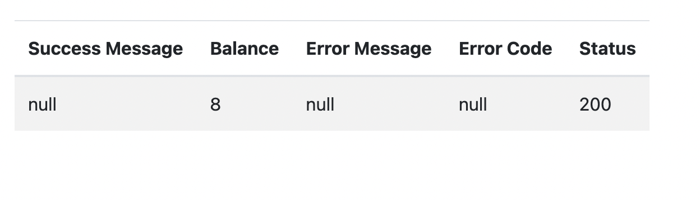

# Lsim Single Sms Package

### You can easily integrate L-sim sms integration with this package

## Requirements

| Lang       | Version |
| ---------- | ---- |
| PHP        | 8.*  |
| Laravel    | 9.*  |

## Installation

```console
composer require sarkhanrasimoghlu/lsim
```

## For export config file

```console
php artisan vendor:publish --tag=sms-config
```

## Configuration Env File

```console
SMS_LOGIN="Your Api Login"
SMS_PASSWORD="Your Api Password"
SMS_SENDER="Your Api Sender Name"
SMS_BASE_URL="Your Api Url"
SMS_CHECK_BALANCE_URL=false
```

## Usage

* Send Sms

```php
return SmsFacade::send('smsText', 'toNumber');
```

* Check Balance
    * First you have to make SMS_CHECK_BALANCE_URL to TRUE in your env file.
    * After making your SMS_CHECK_BALANCE_URL true, copy this code and paste to in your route file.

```php
SmsFacade::smsRoutes();
```
      
* Now you can write this url http://your-url.test/sms-balance on your browser to see your balance like this.



* If you want to customize this view then run this command.

```console
php artisan vendor:publish --tag=sms-views
```


